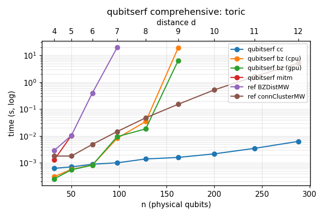
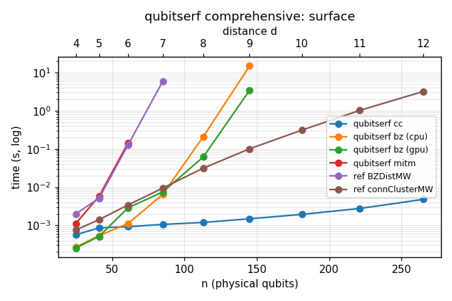
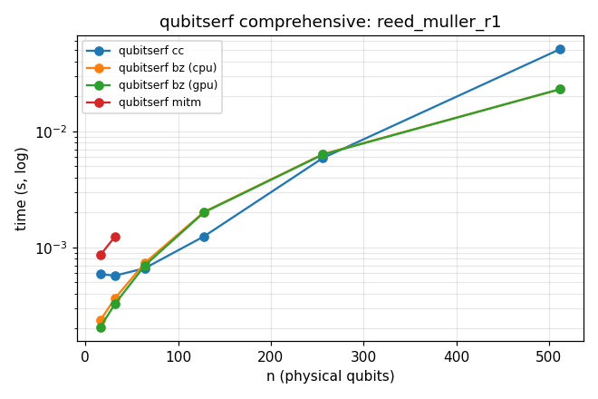
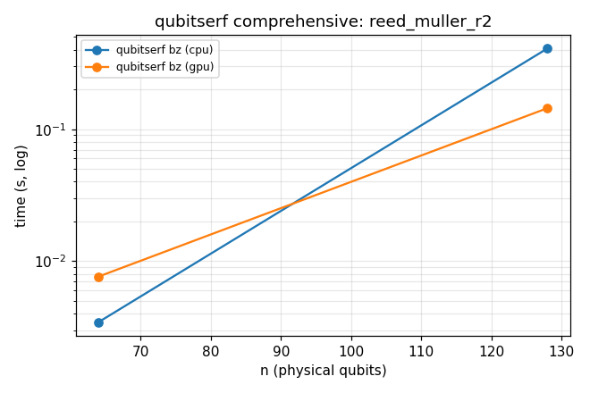

# Benchmarks

Benchmark data and figures for the two parts of `qubitserf`. These numbers were moved out of
the README to keep it focused on usage; the generating scripts live under
[`bench/distfind/`](bench/distfind/) and [`bench/codeaut/`](bench/codeaut/).

---

## distfind — code distance

Benchmark data is generated by the scripts in [`bench/distfind/`](bench/distfind/). The current
headline benchmark is [`bench/distfind/bz_vs_cc.py`](bench/distfind/bz_vs_cc.py), which compares
`cc` on CPU with Brouwer-Zimmermann on CPU and GPU under a uniform 330 second
timeout across a mix of unrelated code families.

### Sparse vs dense

Method choice is not "GPU always wins". Connected-cluster wins on sparse LDPC
Tanner graphs; Brouwer-Zimmermann wins on dense, high-weight checks where cluster
growth loses its structure.

| code | class | n | d | `cc` CPU | `bz` CPU | `bz` GPU |
|---|---|---:|---:|---:|---:|---:|
| steane `[[7,1,3]]` | dense small | 7 | 3 | 12 ms | 5 ms | 35 ms |
| toric L=6 `[[72,2,6]]` | sparse LDPC | 72 | 6 | 6 ms | 5 ms | 33 ms |
| bb `[[72,12,6]]` | sparse LDPC | 72 | 6 | 8 ms | 6 ms | 36 ms |
| toric L=10 `[[200,2,10]]` | sparse LDPC | 200 | 10 | 10 ms | 135.3 s | 40.7 s |
| gross `[[144,12,12]]` | sparse LDPC | 144 | 12 | 297 ms | >330 s | 275.5 s |
| qbch `[[31,1,7]]` | dense BCH | 31 | 7 | 8 ms | 5 ms | 38 ms |
| qbch `[[63,27,7]]` | dense BCH | 63 | 7 | 233 ms | 14 ms | 354 ms |
| qbch `[[127,71,9]]` | dense BCH | 127 | 9 | >330 s | 142.3 s | 26.3 s |

Main takeaways:

- Sparse LDPC codes should use `cc`: toric L=10 certifies in 10 ms by `cc`, while
  BZ takes 40.7 s on the GPU and 135.3 s on the CPU. The gross
  `[[144,12,12]]` code shows the same pattern: `cc` certifies in 297 ms; GPU BZ
  now also certifies the exact distance, but takes 275.5 s.
- Dense quantum BCH codes should use BZ: `qbch [[127,71,9]]` times out in `cc`
  after 330 s, while BZ certifies it in 142.3 s on CPU or 26.3 s on GPU.
- Small cases are dispatch dominated on GPU. The GPU backend matters when BZ
  enumeration is the cost; otherwise CPU BZ can be faster.
- The CPU BZ port inherits the GPU enumeration improvements. On the gross Z-side
  level benchmark, the rewritten CPU path took 84 ms at d=6, 839 ms at d=7,
  7.9 s at d=8, and 79.7 s at d=9, about 20-31x faster than the old CPU path.

### Comprehensive runs

The comprehensive benchmark ([`bench/distfind/comprehensive.py`](bench/distfind/comprehensive.py))
sweeps several CSS / classical families with a **30 second per-run budget** and
cross-checks every method against the known distances. distfind's own `cc` / `bz`
/ `mitm` are measured live; the two reference columns come from the
[`codedistance`](https://pypi.org/project/codedistance/) package
([`codeDistancePYPI`](https://github.com/m-webster/codeDistancePYPI):
`BZDistMW` and `connectedClusterMW`, also under a 30 s timeout) and are reused from
a prior run (the reference code is unchanged), so `n/a` marks a code with no cached
reference. Highlights:

- `distfind cc` certifies the sparse toric/surface/bivariate-bicycle instances out
  to the largest benchmarked sizes (toric/surface `L=12`, `bb [[288,12,12]]`) in
  single- to low-hundreds of milliseconds — up to **~820x faster** than the
  reference connected cluster where it finishes, and it certifies gross
  `[[144,12,12]]` and `bb [[288,12,12]]` where *every* other method times out.
- Brouwer-Zimmermann now certifies toric and surface codes well past where the
  reference BZ quits (which times out by `L=8`): distfind GPU BZ proves toric
  `L=9` in 6.4 s and surface `L=9` in 3.4 s, and only crosses the 30 s budget at
  `L=10`. The toric/surface plots carry a second **distance `d`** axis (top) since
  `d` — not raw `n` — is the hardness scale for these families.
- On the dense Reed-Muller codes the crossover flips: `cc` blows the budget at
  `qrm(2,6)` `[[64,20,8]]` while BZ certifies it in milliseconds and stays fast out
  to `qrm(1,9)` `[[512,492,4]]` (23 ms) and `qrm(2,7)` `[[128,70,8]]` (145 ms).

Family plots from the comprehensive benchmark:









Full benchmark tables and additional plots:

- [`bench/distfind/bz_vs_cc.md`](bench/distfind/bz_vs_cc.md)
- [`bench/distfind/bz_vs_cc.json`](bench/distfind/bz_vs_cc.json)
- [`bench/distfind/comprehensive_results.md`](bench/distfind/comprehensive_results.md)
- [`bench/distfind/results.md`](bench/distfind/results.md)
- [`bench/distfind/cc_results.md`](bench/distfind/cc_results.md)

---

## codeaut — automorphism groups

### Ward benchmark

[`bench/codeaut/compare_ward.py`](bench/codeaut/compare_ward.py) checks exact group equality and
compares four routes: the current native minimum-weight prefix, cocircuit filtering, native
full-scan congruence selection, and fixed-power-of-two Ward. On the 22-case deterministic
benchmark used during development (five repeats, except two deliberately slow cases), Ward used
fewer word vertices on 12/22 cases and fewer edges on 11/22, but was faster on only 2/22. Ordinary
small/random codes took about 5--22 ms through Python/nauty while native Leon took roughly
0.03--1 ms.

The two intended dimension-16 cases show the useful regime. On the direct-sum separation family,
residue 1 modulo 16 reduced 32,768 words to 16 and took about 50--65 ms versus 16--19 s
(roughly 300x). On a harder connected binary-matroid variant it reduced 16,413 words to 16 and
took 208 ms versus 6.67 s (32x); cocircuit filtering retained 135 words and took 72 ms. At
dimension 16 the native full scan still won (9 ms and 44 ms respectively). The compact
construction becomes distinctive once that scan is infeasible: Ward solved the connected `[96,32]`
member exactly from 32 words and a 560-node BDD in roughly 6--7 s; the `2**32` baselines were not
run. The conclusion is to keep Ward guarded and specialized, not replace the highly optimized
min-weight default.

```bash
PYTHONPATH=python python bench/codeaut/compare_ward.py --repeats 5 --slow-repeats 1 --random-per-shape 3
```

### Invariant portfolio

The comprehensive comparison harness validates every exact result by order and mutual generator
containment. On the final 15-case development corpus, every one of the 240 nonbaseline results
matched Leon by order and mutual containment. Native cocircuit filtering was the only general
small-code speed winner (median `0.115 ms`, `1.36x` the minweight baseline). The Python/nauty
portfolio methods were typically one to three orders of magnitude slower on these tiny codes;
their value is exact structural compression and new high-dimensional regimes (LCD projector,
component wreath, and sparse Ward fibers), not a new universal default.

```bash
PYTHONPATH=python python bench/codeaut/compare_invariant_portfolio.py
# use --repeats 3 --json results.json --csv results.csv for a timing sweep
# targeted b/hull/Schur/combined ablations:
PYTHONPATH=python python bench/codeaut/compare_invariant_ablations.py
```
