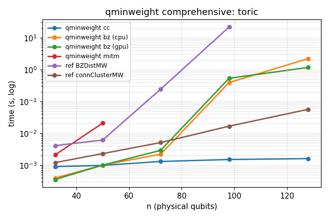
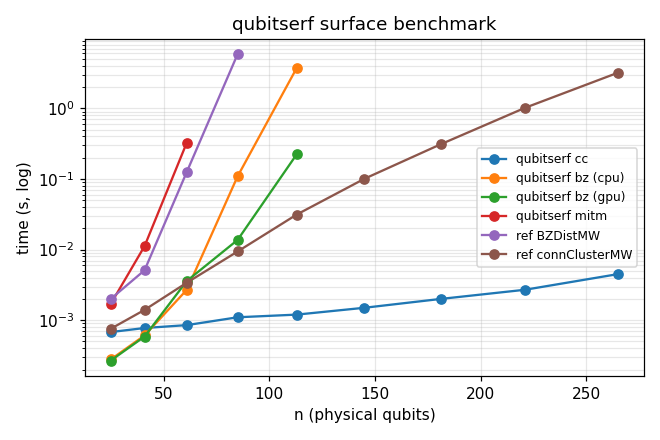
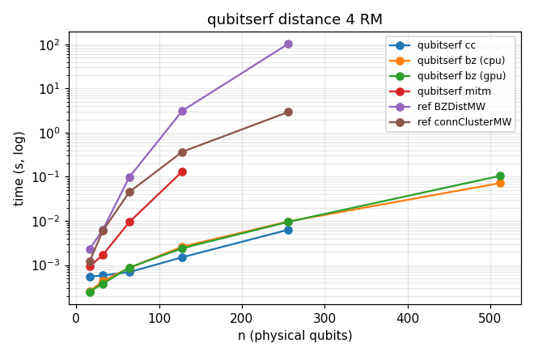
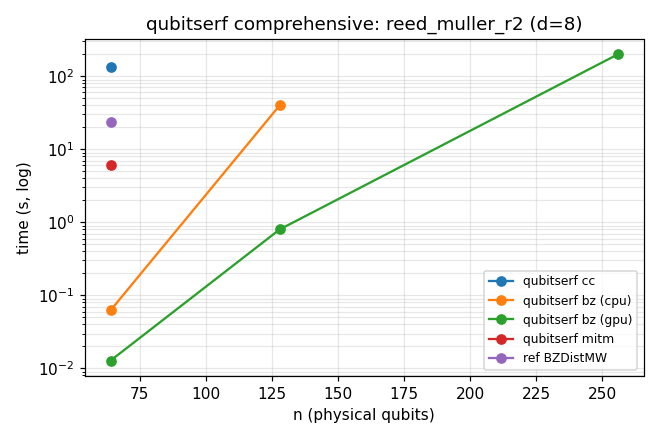

# qminweight

`qminweight` computes exact minimum distances for CSS quantum codes and classical
linear codes. It provides a C++ core, a Python API, and a command-line tool.

## Install

Requirements:

- Python 3.9 or newer.
- CMake 3.20 or newer.
- A C++17 compiler.

Install from the package directory:

```bash
cd research/distance/qminweight
python -m pip install .
```

For development, install the Python package with test dependencies:

```bash
python -m pip install -e ".[dev]"
```

To build the native library, C++ CLI, and C++ tests in-tree:

```bash
./build.sh
```

The package install provides the `qminweight` command. The development build also
creates `build/qminweight`.

## Command-Line Use

`qminweight` accepts CSS stabiliser strings, CSS parity-check matrices, or a
classical parity-check matrix. CSS stabiliser input can come from stdin, a file,
or a pipe. End interactive stdin with EOF, usually `Ctrl-D`.

Small stdin example:

```console
$ qminweight --zx
XXXX
ZZZZ
<Ctrl-D>
2 2
```

Here `--zx` prints both CSS components as `dZ dX`.

A slightly larger CSS stabiliser example:

```text
XXXXIII
XXIIXXI
XIXIXIX
ZZZZIII
ZZIIZZI
ZIZIZIZ
```

From stdin:

```console
$ printf 'XXXXIII\nXXIIXXI\nXIXIXIX\nZZZZIII\nZZIIZZI\nZIZIZIZ\n' | qminweight - --zx
3 3
```

From a file containing the same rows:

```console
$ qminweight example_code.txt
3

$ qminweight example_code.txt --zx
3 3

$ qminweight example_code.txt --which z
3

$ qminweight example_code.txt --method cc --threads 8
3
```

Verbose mode prints progress diagnostics to stderr; the final distance still
goes to stdout. For example, with connected cluster:

```console
$ qminweight example_code.txt --method cc -v
[cc dZ] n=7 checks=3 logicals=1 threads=7 maxw=7
[cc dZ] no weight-1 logical -> d>1  (0.11s)
[cc dZ] no weight-2 logical -> d>2  (0.10s)
[cc dZ] d=3  FOUND weight-3 logical  (0.10s)
[cc dX] n=7 checks=3 logicals=1 threads=7 maxw=7
[cc dX] no weight-1 logical -> d>1  (0.10s)
[cc dX] no weight-2 logical -> d>2  (0.11s)
[cc dX] d=3  FOUND weight-3 logical  (0.10s)
3
```

Timing and thread counts vary by machine and problem size.

Machine-readable output, with timing and backend varying by machine:

```console
$ qminweight example_code.txt --json
{"distance": 3, "lower_bound": 3, "proven": true, "seconds": 0.001, "backend": "cpu", "which": "d"}
```

For CSS parity-check matrices:

```console
$ qminweight --hx Hx.txt --hz Hz.txt
3

$ qminweight --hx Hx.mtx --hz Hz.mtx --method cc
3

$ qminweight --hx Hx.mtx --hz Hz.mtx --method bz --backend gpu --json
{"distance": 3, "lower_bound": 3, "proven": true, "seconds": 0.001, "backend": "gpu", "which": "d"}
```

For a classical linear code:

```console
$ qminweight --classical H.txt
3

$ qminweight --classical H.mtx --method bz
3

$ qminweight --classical H.txt --method mitm
3
```

Show the installed compute backends. The exact list depends on the machine:

```console
$ qminweight --list-backends
cpu
gpu
```

Useful options:

- `--method bz`, `--method cc`, or `--method mitm`.
- `--backend auto`, `--backend cpu`, or `--backend gpu`.
- `--which min`, `--which z`, or `--which x` for CSS codes.
- `--threads N` to set CPU worker threads.
- `--max-weight N` to cap an expensive search and return a certified bracket.
- `-v` or `--verbose` to print progress diagnostics to stderr.
- `--list-backends` to show usable backends.

Use `cc` for sparse CSS codes such as LDPC, topological, and bivariate-bicycle
codes. Use `bz` for dense or random codes, or when using the GPU backend. Use
`mitm` mainly as a small-code cross-check.

## Python Use

The Python API works with NumPy-compatible binary matrices.

```python
import numpy as np
import qminweight as df

Hx = np.loadtxt("Hx.txt", dtype=np.uint8)
Hz = np.loadtxt("Hz.txt", dtype=np.uint8)

r = df.css_distance(Hx, Hz, method="bz", backend="gpu")
print(r.distance, r.proven, r.seconds, r.backend)
```

For a distance-3 example, output looks like:

```text
3 True 0.001 gpu
```

The exact `seconds` value varies by machine. The `gpu` backend automatically
uses the available accelerator for the current platform.

For one CSS component:

```python
d_z = df.css_distance(Hx, Hz, which="z", method="cc")
d_x = df.css_distance(Hx, Hz, which="x", method="cc")
```

For a classical code:

```python
H = np.loadtxt("H.txt", dtype=np.uint8)
r = df.classical_distance(H, method="bz")
print(r.distance)
```

### Method selection

Use `method="cc"` (connected cluster) for **QLDPC codes** — sparse codes such as
bivariate-bicycle, hypergraph-product, toric, and surface codes. It exploits the
low-weight structure of the stabilizers and typically certifies the distance in
milliseconds regardless of code size, where Brouwer-Zimmermann cannot finish.

Use `method="bz"` (Brouwer-Zimmermann) for **general CSS codes** — dense, random,
or codes without exploitable sparsity. It is also the right choice when a GPU is
available, since the GPU backend only accelerates BZ.

```python
# QLDPC / sparse code — CC wins
r = df.css_distance(Hx, Hz, method="cc")

# Dense or random code, or GPU run — BZ wins
r = df.css_distance(Hx, Hz, method="bz", backend="gpu")
```

### Code size limits

There is no fixed qubit-count limit. Codewords are bit-packed into
`ceil(n/64)` 64-bit words and every host routine is sized dynamically, so the
CPU backend (both `bz` and `cc`) handles arbitrary `n`.

The **GPU** runs its native BZ kernel for codes up to **1024 physical qubits**
(codeword stride ≤ 16 words); above that it automatically falls back to the CPU
solver for the same exact result, just without GPU acceleration. (The GPU kernel
also falls back to the CPU for Brouwer-Zimmermann *weight levels* deeper than 32
selected rows, an axis independent of `n`.) Small problems always run on the CPU
regardless of backend, below an internal work threshold where GPU dispatch
latency would dominate (tunable via `QMINWEIGHT_GPU_MIN_WORK`).

```python
# 512- and 1024-qubit dense codes run the native GPU BZ kernel:
r = df.css_distance(Hx, Hz, method="bz", backend="gpu")   # n up to 1024
# n > 1024 transparently uses the CPU solver (same answer).
```

### Thread count

`threads=0` (the default) uses all logical CPU cores
(`std::thread::hardware_concurrency()`). For very small enumeration problems the
library falls back to a single thread automatically regardless of this setting.
Pass an explicit count to cap parallelism, for example when running multiple
solves concurrently:

```python
# Use 4 CPU threads instead of all available cores.
r = df.css_distance(Hx, Hz, method="cc", threads=4)
```

`Result` fields:

- `distance`: best distance found; exact when `proven` is true.
- `lower_bound`: certified lower bound.
- `proven`: whether `distance == lower_bound`.
- `seconds`: wall-clock runtime.
- `backend`: backend used for the run.

## Benchmarks

Benchmark data is generated by the scripts in [`bench/`](bench/). The tables
below are from [`bench/comprehensive_results.md`](bench/comprehensive_results.md)
and [`bench/results.md`](bench/results.md). Reference results use
the [`codedistance`](https://pypi.org/project/codedistance/) package from
[`codeDistancePYPI`](https://github.com/m-webster/codeDistancePYPI), specifically
[`BZDistMW`](https://github.com/m-webster/codeDistancePYPI) and
[`connectedClusterMW`](https://github.com/m-webster/codeDistancePYPI), with a
30 second per-code timeout.

Max stab. weight is the largest row weight of `Hx` = `Hz`; these codes are all QLDPC
(low, `n`-independent stabilizer weight), which is the regime `cc` exploits.

| code | n | d | max stab. weight | qminweight result | reference [`BZDistMW`](https://github.com/m-webster/codeDistancePYPI) | reference [`connectedClusterMW`](https://github.com/m-webster/codeDistancePYPI) |
|---|---:|---:|---:|---|---|---|
| toric L=7 | 98 | 7 | 4 | `cc`: 1.1 ms, `bz gpu`: 21.5 ms | 19.58 s | 14.7 ms |
| toric L=8 | 128 | 8 | 4 | `cc`: 1.3 ms, `bz gpu`: 76.2 ms | timeout | 47.7 ms |
| surface L=12 | 265 | 12 | 4 | `cc`: 5.2 ms, `bz gpu`: `[8,12]` 7.6 s (cpu 153.7 s) | — | 3.42 s |
| toric L=12 | 288 | 12 | 4 | `cc`: 6.3 ms, `bz gpu`: `[8,12]` 14.1 s (cpu 283.8 s) | — | 5.19 s |
| gross `[[144,12,12]]` | 144 | 12 | 6 | `cc`: 185 ms, `bz gpu`: `[8,12]` 287 ms | timeout | timeout |

Summary from the comprehensive benchmark:

- All qminweight methods agreed with the known distance or the reference result
  wherever the reference completed correctly.
- Against reference [`BZDistMW`](https://github.com/m-webster/codeDistancePYPI),
  `qminweight cc` had a median speedup of 12.8x and a maximum speedup of 18232x
  over the completed comparison runs.
- Against reference
  [`connectedClusterMW`](https://github.com/m-webster/codeDistancePYPI),
  `qminweight cc` had a median speedup of 11.3x and a maximum speedup of 821x.
- `qminweight cc` scales where everything else stops: it certifies the exact
  distance of every code out to **n = 288** (toric up to L=12) in single- to
  low-hundreds of milliseconds. Brouwer-Zimmermann is only attempted up to n = 144
  (above that it cannot finish in budget) and the reference `connectedClusterMW`
  is 100–800x slower where it finishes at all (e.g. toric L=12: `cc` 6.3 ms vs
  5.19 s, 821x).
- On Brouwer-Zimmermann runs where the enumeration is the actual cost (CPU solve
  > ~10 ms — the regime the GPU backend is meant for), the GPU is many times
  faster than the CPU on the Apple M4: e.g. toric L=7 11.3x, toric L=8 18.2x,
  gross 15.2x (the `bz_cpu / bz_gpu` column of
  [`comprehensive_results.md`](bench/comprehensive_results.md)); the focused
  [`bench/gpu_vs_cpu.py`](bench/gpu_vs_cpu.py) reports a median **~13x** over the
  codes in that regime. Sub-millisecond codes are dominated by the shared
  random-information-set seed and per-dispatch latency, so CPU and GPU tie there
  (the GPU path falls back to the CPU below `QMINWEIGHT_GPU_MIN_WORK`).
- `qminweight cc` was the only benchmarked method that certified the gross
  `[[144,12,12]]` distance within the timeout.

Each family plot shows wall-clock time vs `n` (log scale) for every method.

### Toric Codes



### Surface Codes



### Reed-Muller CSS Codes (dense, non-QLDPC)

The `reed_muller_r1` and `reed_muller_r2` families use quantum Reed-Muller CSS codes
`Hx = Hz = G_RM(r, m)` (valid when `2r < m-1`): parameters `[[2^m, 2^m − 2·Σ C(m,i), 2^(r+1)]]`.
These codes are emphatically **not QLDPC**: the stabilizer (`Hx`=`Hz` row) weights are the
monomial-evaluation weights `2^m, 2^(m-1), …, 2^(m-r)`, so the *maximum* stabilizer weight is
`2^m = n` (the all-ones constant monomial) and even the *minimum* is `n/2^r`, both **growing
with `n`** (the opposite of a QLDPC family, whose stabilizer weight is constant). Because every
check is that dense, the connected-cluster algorithm degenerates to `O(C(n,d))` work just like
MITM, while BZ finds the small-weight codewords quickly. The `bz` column below is the GPU backend.

| family | code | n | d | max stab. weight | `cc` | `bz gpu` |
|---|---|---:|---:|---:|---|---|
| `reed_muller_r1` | `[[16,6,4]]`   | 16  | 4 | 16  | < 1 ms  | < 1 ms |
| `reed_muller_r1` | `[[256,238,4]]`| 256 | 4 | 256 | ~6 ms   | ~9 ms |
| `reed_muller_r1` | `[[512,492,4]]`| 512 | 4 | 512 | ~82 ms  | ~0.11 s |
| `reed_muller_r2` | `[[64,20,8]]`  | 64  | 8 | 64  | ~136 s  | ~12 ms |
| `reed_muller_r2` | `[[128,70,8]]` | 128 | 8 | 128 | timeout | ~0.8 s |
| `reed_muller_r2` | `[[256,182,8]]`| 256 | 8 | 256 | timeout | 216 s |

For `d=4` (r=1 family) the search stays shallow, so every method remains fast (sub-second)
out to `n=512`. For `d=8` (r=2 family) the gap is stark: CC is already ~10⁴× slower than BZ at
`n=64` (~136 s vs ~12 ms) and times out entirely at `n=128` and `n=256`, while BZ still
certifies — instantly at `n=128`, and even at `n=256` (where its own bound converges slowly,
216 s) it is the *only* method that finishes at all.





Full benchmark tables and additional plots:

- [`bench/comprehensive_results.md`](bench/comprehensive_results.md)
- [`bench/results.md`](bench/results.md)
- [`bench/cc_results.md`](bench/cc_results.md)

## Citation

If you use qminweight in academic work, please cite the package and the underlying methods.

```bibtex
@software{qminweight,
  title  = {qminweight: exact minimum distance of CSS quantum and classical linear codes},
  author = {Serban Cercelescu},
  year   = {2026},
  note   = {C++ core with CPU/CUDA/Metal backends; Brouwer--Zimmermann, connected-cluster,
            and meet-in-the-middle solvers},
  url    = {https://github.com/Quantinuum/qminweight}
}

```
