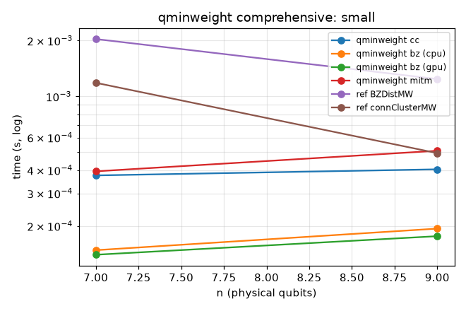
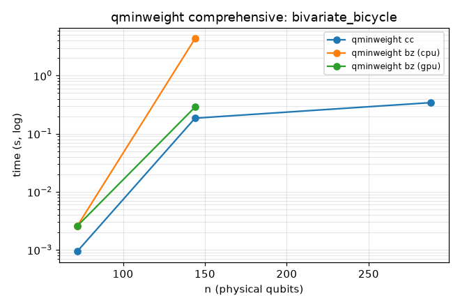
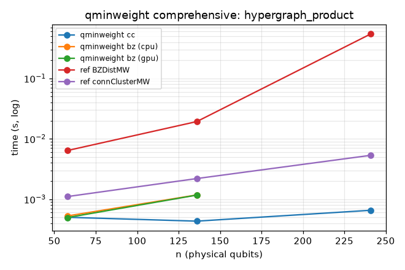

# qminweight comprehensive benchmark results

Generated by `bench/comprehensive.py`. Each cell shows the reported distance and wall-clock time. A `[lower,upper]` cell is a BZ run capped at a max_weight (rigorous bracket, distance not certified there). `timeout` means the per-method budget was exceeded.

Methods: **qminweight cc** (connected cluster), **qminweight bz** on cpu and gpu (Brouwer-Zimmermann, capped on hard sparse codes), **qminweight mitm** (meet-in-the-middle, small n only), and the reference `codeDistance` package's **BZDistMW** and **connectedClusterMW** (subprocess, hard timeout).

### CSS: small

| code | n | known d | qminweight cc | qminweight bz (cpu) | qminweight bz (gpu) | qminweight mitm | ref BZDistMW | ref connClusterMW | ref_bz / cc | ref_cc / cc | bz_cpu / bz_gpu |
|---|---|---|---|---|---|---|---|---|---|---|---|
| steane [[7,1,3]] | 7 | 3 | 3 375us | 3 148us | 3 140us | 3 395us | 3 2.0ms | 3 1.2ms | 5.4x | 3.2x | 1.1x |
| shor [[9,1,3]] | 9 | 3 | 3 405us | 3 194us | 3 176us | 3 509us | 3 1.2ms | 0 495us | 3.1x | 1.2x | 1.1x |

### CSS: toric

| code | n | known d | qminweight cc | qminweight bz (cpu) | qminweight bz (gpu) | qminweight mitm | ref BZDistMW | ref connClusterMW | ref_bz / cc | ref_cc / cc | bz_cpu / bz_gpu |
|---|---|---|---|---|---|---|---|---|---|---|---|
| toric L=4 | 32 | 4 | 4 633us | 4 312us | 4 266us | 4 1.8ms | 4 2.9ms | 4 1.8ms | 4.6x | 2.9x | 1.2x |
| toric L=5 | 50 | 5 | 5 806us | 5 838us | 5 830us | 5 19.3ms | 5 10.5ms | 5 1.8ms | 13.0x | 2.3x | 1.0x |
| toric L=6 | 72 | 6 | 6 921us | 6 1.9ms | 6 1.8ms | skip | 6 400.2ms | 6 4.9ms | 434.6x | 5.3x | 1.0x |
| toric L=7 | 98 | 7 | 7 1.1ms | 7 243.6ms | 7 21.5ms | skip | 7 19.58s | 7 14.7ms | 18232.0x | 13.7x | 11.3x |
| toric L=8 | 128 | 8 | 8 1.3ms | 8 1.38s | 8 76.2ms | skip | timeout 30.01s | 8 47.7ms | - | 37.4x | 18.2x |
| toric L=9 | 162 | 9 | 9 1.6ms | skip | skip | skip | - | 9 152.1ms | - | 93.6x | - |
| toric L=10 | 200 | 10 | 10 2.2ms | skip | skip | skip | - | 10 522.0ms | - | 238.2x | - |
| toric L=11 | 242 | 11 | 11 3.3ms | skip | skip | skip | - | 11 1.63s | - | 494.1x | - |
| toric L=12 | 288 | 12 | 12 6.3ms | skip | skip | skip | - | 12 5.19s | - | 821.4x | - |

### CSS: surface

| code | n | known d | qminweight cc | qminweight bz (cpu) | qminweight bz (gpu) | qminweight mitm | ref BZDistMW | ref connClusterMW | ref_bz / cc | ref_cc / cc | bz_cpu / bz_gpu |
|---|---|---|---|---|---|---|---|---|---|---|---|
| surface L=4 | 25 | 4 | 4 679us | 4 278us | 4 268us | 4 1.7ms | 4 2.0ms | 4 756us | 3.0x | 1.1x | 1.0x |
| surface L=5 | 41 | 5 | 5 775us | 5 609us | 5 587us | 5 11.2ms | 5 5.1ms | 5 1.4ms | 6.6x | 1.8x | 1.0x |
| surface L=6 | 61 | 6 | 6 852us | 6 2.7ms | 6 3.6ms | 6 328.8ms | 6 126.5ms | 6 3.4ms | 148.4x | 4.0x | 0.7x |
| surface L=7 | 85 | 7 | 7 1.1ms | 7 108.9ms | 7 13.7ms | skip | 7 5.86s | 7 9.4ms | 5543.1x | 8.9x | 8.0x |
| surface L=8 | 113 | 8 | 8 1.2ms | 8 3.75s | 8 224.4ms | skip | timeout 30.01s | 8 31.4ms | - | 25.3x | 16.7x |
| surface L=9 | 145 | 9 | 9 1.5ms | skip | skip | skip | - | 9 100.8ms | - | 65.5x | - |
| surface L=10 | 181 | 10 | 10 2.0ms | skip | skip | skip | - | 10 309.7ms | - | 158.0x | - |
| surface L=11 | 221 | 11 | 11 2.7ms | skip | skip | skip | - | 11 1.02s | - | 376.1x | - |
| surface L=12 | 265 | 12 | 12 4.5ms | skip | skip | skip | - | 12 3.21s | - | 707.2x | - |

### CSS: bivariate_bicycle

| code | n | known d | qminweight cc | qminweight bz (cpu) | qminweight bz (gpu) | qminweight mitm | ref BZDistMW | ref connClusterMW | ref_bz / cc | ref_cc / cc | bz_cpu / bz_gpu |
|---|---|---|---|---|---|---|---|---|---|---|---|
| bb [[72,12,6]] | 72 | 6 | 6 937us | 6 2.6ms | 6 2.6ms | skip | 6 939.7ms | 6 29.1ms | 1002.5x | 31.1x | 1.0x |
| gross [[144,12,12]] | 144 | 12 | 12 185.2ms | [8,12] 4.36s | [8,12] 287.4ms | skip | timeout 30.01s | timeout 30.01s | - | - | 15.2x |
| bb [[288,12,12]] | 288 | ? | 12 342.7ms | skip | skip | skip | - | - | - | - | - |

### CSS: hypergraph_product

| code | n | known d | qminweight cc | qminweight bz (cpu) | qminweight bz (gpu) | qminweight mitm | ref BZDistMW | ref connClusterMW | ref_bz / cc | ref_cc / cc | bz_cpu / bz_gpu |
|---|---|---|---|---|---|---|---|---|---|---|---|
| hgp(ham3)  | 58 | 3 | 3 502us | 3 528us | 3 497us | 3 1.6ms | 3 6.4ms | 3 1.1ms | 12.8x | 2.2x | 1.1x |
| hgp(ldpc6x10)  | 136 | ? | 2 433us | 2 1.2ms | 2 1.2ms | skip | 2 19.3ms | 2 2.2ms | 44.6x | 5.1x | 1.0x |
| hgp(ham4)  | 241 | 3 | 3 656us | skip | skip | skip | 3 547.6ms | 3 5.3ms | 835.1x | 8.1x | - |

### Classical codes

| code | n | known d | qminweight cc | qminweight bz (cpu) | qminweight bz (gpu) | qminweight mitm | ref BZDistMW | ref_bz / cc | ref_cc / cc | bz_cpu / bz_gpu |
|---|---|---|---|---|---|---|---|---|---|---|
| hamming r=3 | 7 | 3 | 3 91us | 3 97us | 3 83us | 3 182us | 3 572us | 6.3x | - | 1.2x |
| hamming r=4 | 15 | 3 | 3 128us | 3 119us | 3 105us | 3 329us | 3 801us | 6.2x | - | 1.1x |
| rand_ldpc(12,18,3) | 18 | ? | 2 278us | 2 268us | 2 241us | 2 214us | 2 977us | 3.5x | - | 1.1x |

## Summary

- Backends available: `['cpu', 'gpu']`.
- Per-code qminweight budget: 20s; bz only for n <= 144; mitm only for n <= 62; reference subprocess timeout 30s; BZ max_weight cap on hard codes: 6.
- **ref BZDistMW / qminweight cc speedup**: median 12.8x, max 18232.0x, min 3.0x (over 17 codes).
- **ref connectedClusterMW / qminweight cc speedup**: median 11.3x, max 821.4x, min 1.1x (over 24 codes).
- **qminweight bz cpu / gpu speedup**: median 1.1x, max 18.2x, min 0.7x (over 19 codes).
- Fastest-finished method per code: qminweight cc: 20, qminweight bz (gpu): 8, qminweight mitm: 1.
- **Only qminweight cc certified the exact distance** on: gross [[144,12,12]], bb [[288,12,12]] (every other method either timed out, was capped without proving, or was skipped).
- Reference timed out (> 30s) on: gross [[144,12,12]], surface L=8, toric L=8 — qminweight cc solved all of these.
- **All qminweight distances agree**: qminweight cc / bz (cpu+gpu) / mitm reported the same exact distance on every code, matching the known textbook distances where those are defined, and matching the reference where the reference is correct.
- **Reference-package defects flagged** (qminweight + textbook agree; a reference method disagrees -- qminweight is correct):
    - shor [[9,1,3]]: [('cc', 3), ('bz_cpu', 3), ('bz_gpu', 3), ('mitm', 3), ('ref_bz', 3), ('ref_cc', 0), ('known', 3)]  (reference connectedClusterMW mis-reports the Z-component)

### Plots

