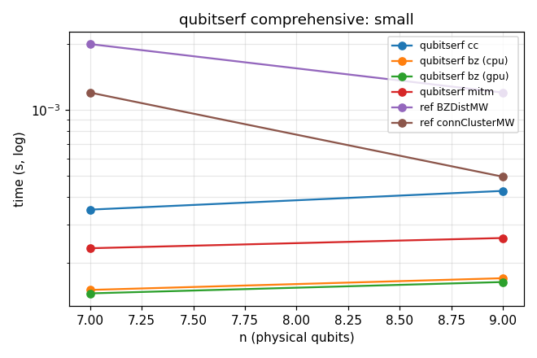
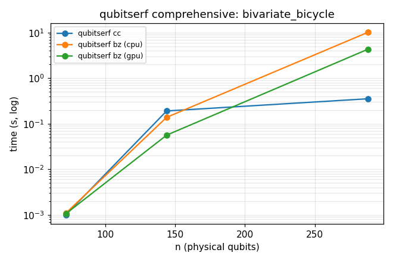
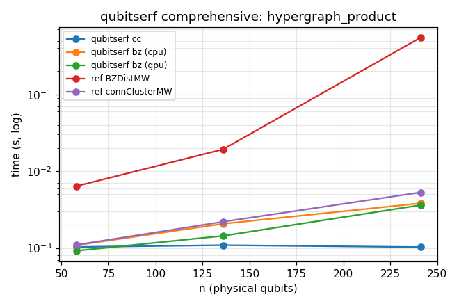

# qubitserf comprehensive benchmark results

> **Note.** These numbers predate the removal of the `max_weight` cap from the API and have
> not been re-run. The `[lower,upper]` cells come from that now-removed feature (a BZ run
> stopped at a capped weight); BZ on those codes is now simply reported as a `timeout`.

Generated by `bench/comprehensive.py`. Each cell shows the reported distance and wall-clock time. A `[lower,upper]` cell is a BZ run capped at a max_weight (rigorous bracket, distance not certified there). `timeout` means the per-method budget was exceeded.

Methods: **qubitserf cc** (connected cluster), **qubitserf bz** on cpu and gpu (Brouwer-Zimmermann, capped on hard sparse codes), **qubitserf mitm** (meet-in-the-middle, small n only), and the reference `codeDistance` package's **BZDistMW** and **connectedClusterMW**.

qubitserf timings are freshly measured; the two reference columns are **reused from a prior 30s run** (`bench/ref_cache.json`) — the reference code is unchanged, so its numbers are carried over rather than re-executed. `n/a` marks codes with no cached reference (the Reed-Muller families, added later).

### CSS: small

| code | n | known d | qubitserf cc | qubitserf bz (cpu) | qubitserf bz (gpu) | qubitserf mitm | ref BZDistMW | ref connClusterMW | ref_bz / cc | ref_cc / cc | bz_cpu / bz_gpu |
|---|---|---|---|---|---|---|---|---|---|---|---|
| steane [[7,1,3]] | 7 | 3 | 3 350us | 3 150us | 3 145us | 3 233us | 3 2.0ms | 3 1.2ms | 5.7x | 3.4x | 1.0x |
| shor [[9,1,3]] | 9 | 3 | 3 426us | 3 170us | 3 163us | 3 260us | 3 1.2ms | 0 495us | 2.8x | 1.2x | 1.0x |

### CSS: toric

| code | n | known d | qubitserf cc | qubitserf bz (cpu) | qubitserf bz (gpu) | qubitserf mitm | ref BZDistMW | ref connClusterMW | ref_bz / cc | ref_cc / cc | bz_cpu / bz_gpu |
|---|---|---|---|---|---|---|---|---|---|---|---|
| toric L=4 | 32 | 4 | 4 630us | 4 311us | 4 256us | 4 1.3ms | 4 2.9ms | 4 1.8ms | 4.6x | 2.9x | 1.2x |
| toric L=5 | 50 | 5 | 5 710us | 5 574us | 5 556us | 5 10.5ms | 5 10.5ms | 5 1.8ms | 14.8x | 2.5x | 1.0x |
| toric L=6 | 72 | 6 | 6 897us | 6 837us | 6 828us | skip | 6 400.2ms | 6 4.9ms | 445.9x | 5.5x | 1.0x |
| toric L=7 | 98 | 7 | 7 1.0ms | 7 8.3ms | 7 9.5ms | skip | 7 19.58s | 7 14.7ms | 19392.5x | 14.6x | 0.9x |
| toric L=8 | 128 | 8 | 8 1.4ms | 8 34.9ms | 8 18.5ms | skip | timeout 30.01s | 8 47.7ms | - | 34.0x | 1.9x |
| toric L=9 | 162 | 9 | 9 1.6ms | 9 18.93s | 9 6.38s | skip | n/a | 9 152.1ms | - | 95.1x | 3.0x |
| toric L=10 | 200 | 10 | 10 2.2ms | timeout 30.00s | timeout 30.00s | skip | n/a | 10 522.0ms | - | 239.7x | - |
| toric L=11 | 242 | 11 | 11 3.5ms | - | - | skip | n/a | 11 1.63s | - | 468.8x | - |
| toric L=12 | 288 | 12 | 12 6.3ms | - | - | skip | n/a | 12 5.19s | - | 821.2x | - |

### CSS: surface

| code | n | known d | qubitserf cc | qubitserf bz (cpu) | qubitserf bz (gpu) | qubitserf mitm | ref BZDistMW | ref connClusterMW | ref_bz / cc | ref_cc / cc | bz_cpu / bz_gpu |
|---|---|---|---|---|---|---|---|---|---|---|---|
| surface L=4 | 25 | 4 | 4 565us | 4 268us | 4 253us | 4 1.1ms | 4 2.0ms | 4 756us | 3.5x | 1.3x | 1.1x |
| surface L=5 | 41 | 5 | 5 856us | 5 534us | 5 512us | 5 5.7ms | 5 5.1ms | 5 1.4ms | 6.0x | 1.6x | 1.0x |
| surface L=6 | 61 | 6 | 6 920us | 6 1.1ms | 6 2.9ms | 6 142.3ms | 6 126.5ms | 6 3.4ms | 137.5x | 3.7x | 0.4x |
| surface L=7 | 85 | 7 | 7 1.1ms | 7 6.4ms | 7 7.5ms | skip | 7 5.86s | 7 9.4ms | 5563.9x | 8.9x | 0.9x |
| surface L=8 | 113 | 8 | 8 1.2ms | 8 209.1ms | 8 61.6ms | skip | timeout 30.01s | 8 31.4ms | - | 26.4x | 3.4x |
| surface L=9 | 145 | 9 | 9 1.5ms | 9 14.88s | 9 3.43s | skip | n/a | 9 100.8ms | - | 68.1x | 4.3x |
| surface L=10 | 181 | 10 | 10 1.9ms | timeout 30.00s | timeout 30.00s | skip | n/a | 10 309.7ms | - | 160.7x | - |
| surface L=11 | 221 | 11 | 11 2.8ms | - | - | skip | n/a | 11 1.02s | - | 370.5x | - |
| surface L=12 | 265 | 12 | 12 4.8ms | - | - | skip | n/a | 12 3.21s | - | 672.8x | - |

### CSS: bivariate_bicycle

| code | n | known d | qubitserf cc | qubitserf bz (cpu) | qubitserf bz (gpu) | qubitserf mitm | ref BZDistMW | ref connClusterMW | ref_bz / cc | ref_cc / cc | bz_cpu / bz_gpu |
|---|---|---|---|---|---|---|---|---|---|---|---|
| bb [[72,12,6]] | 72 | 6 | 6 1.0ms | 6 1.1ms | 6 1.1ms | skip | 6 939.7ms | 6 29.1ms | 930.6x | 28.8x | 1.0x |
| gross [[144,12,12]] | 144 | 12 | 12 190.7ms | [8,12] 138.3ms | [8,12] 56.2ms | skip | timeout 30.01s | timeout 30.01s | - | - | 2.5x |
| bb [[288,12,12]] | 288 | ? | 12 353.1ms | [8,12] 10.15s | [8,12] 4.32s | skip | n/a | n/a | - | - | 2.3x |

### CSS: hypergraph_product

| code | n | known d | qubitserf cc | qubitserf bz (cpu) | qubitserf bz (gpu) | qubitserf mitm | ref BZDistMW | ref connClusterMW | ref_bz / cc | ref_cc / cc | bz_cpu / bz_gpu |
|---|---|---|---|---|---|---|---|---|---|---|---|
| hgp(ham3)  | 58 | 3 | 3 1.0ms | 3 1.1ms | 3 921us | 3 1.5ms | 3 6.4ms | 3 1.1ms | 6.2x | 1.1x | 1.2x |
| hgp(ldpc6x10)  | 136 | ? | 2 1.1ms | 2 2.1ms | 2 1.4ms | skip | 2 19.3ms | 2 2.2ms | 17.7x | 2.0x | 1.4x |
| hgp(ham4)  | 241 | 3 | 3 1.0ms | 3 3.8ms | 3 3.6ms | skip | 3 547.6ms | 3 5.3ms | 532.5x | 5.2x | 1.1x |

### CSS: reed_muller_r1

| code | n | known d | qubitserf cc | qubitserf bz (cpu) | qubitserf bz (gpu) | qubitserf mitm | ref BZDistMW | ref connClusterMW | ref_bz / cc | ref_cc / cc | bz_cpu / bz_gpu |
|---|---|---|---|---|---|---|---|---|---|---|---|
| qrm(r=1,m=4) [[16,6,4]] | 16 | 4 | 4 587us | 4 235us | 4 206us | 4 859us | n/a | n/a | - | - | 1.1x |
| qrm(r=1,m=5) [[32,20,4]] | 32 | 4 | 4 571us | 4 366us | 4 327us | 4 1.2ms | n/a | n/a | - | - | 1.1x |
| qrm(r=1,m=6) [[64,50,4]] | 64 | 4 | 4 661us | 4 735us | 4 698us | skip | n/a | n/a | - | - | 1.1x |
| qrm(r=1,m=7) [[128,112,4]] | 128 | 4 | 4 1.2ms | 4 2.0ms | 4 2.0ms | skip | n/a | n/a | - | - | 1.0x |
| qrm(r=1,m=8) [[256,238,4]] | 256 | 4 | 4 5.9ms | 4 6.4ms | 4 6.3ms | skip | n/a | n/a | - | - | 1.0x |
| qrm(r=1,m=9) [[512,492,4]] | 512 | 4 | 4 51.2ms | 4 23.1ms | 4 23.1ms | skip | n/a | n/a | - | - | 1.0x |

### CSS: reed_muller_r2

| code | n | known d | qubitserf cc | qubitserf bz (cpu) | qubitserf bz (gpu) | qubitserf mitm | ref BZDistMW | ref connClusterMW | ref_bz / cc | ref_cc / cc | bz_cpu / bz_gpu |
|---|---|---|---|---|---|---|---|---|---|---|---|
| qrm(r=2,m=6) [[64,20,8]] | 64 | 8 | timeout 30.00s | 8 3.5ms | 8 7.7ms | skip | n/a | n/a | - | - | 0.5x |
| qrm(r=2,m=7) [[128,70,8]] | 128 | 8 | - | 8 409.9ms | 8 144.5ms | skip | n/a | n/a | - | - | 2.8x |
| qrm(r=2,m=8) [[256,182,8]] | 256 | 8 | - | timeout 30.00s | timeout 30.00s | skip | n/a | n/a | - | - | - |

### Classical codes

| code | n | known d | qubitserf cc | qubitserf bz (cpu) | qubitserf bz (gpu) | qubitserf mitm | ref BZDistMW | ref_bz / cc | ref_cc / cc | bz_cpu / bz_gpu |
|---|---|---|---|---|---|---|---|---|---|---|
| hamming r=3 | 7 | 3 | 3 109us | 3 89us | 3 83us | 3 203us | 3 572us | 5.2x | - | 1.1x |
| hamming r=4 | 15 | 3 | 3 143us | 3 120us | 3 110us | 3 338us | 3 801us | 5.6x | - | 1.1x |
| rand_ldpc(12,18,3) | 18 | ? | 2 249us | 2 253us | 2 250us | 2 202us | 2 977us | 3.9x | - | 1.0x |

## Summary

- Backends available: `['cpu', 'gpu']`.
- Per-code qubitserf budget: 30s; bz only for n <= 1024; mitm only for n <= 62; reference numbers reused from a prior 30s run (not re-executed); BZ max_weight cap on hard codes: 6.
- **ref BZDistMW / qubitserf cc speedup**: median 6.2x, max 19392.5x, min 2.8x (over 17 codes).
- **ref connectedClusterMW / qubitserf cc speedup**: median 11.7x, max 821.2x, min 1.1x (over 24 codes).
- **qubitserf bz cpu / gpu speedup**: median 1.1x, max 4.3x, min 0.4x (over 31 codes).
- Fastest-finished method per code: qubitserf cc: 20, qubitserf bz (gpu): 14, qubitserf bz (cpu): 2, qubitserf mitm: 1.
- **Only qubitserf cc certified the exact distance** on: gross [[144,12,12]], bb [[288,12,12]] (every other method either timed out, was capped without proving, or was skipped).
- Reference timed out (> 30s) on: gross [[144,12,12]], surface L=8, toric L=8 — qubitserf cc solved all of these.
- **All qubitserf distances agree**: qubitserf cc / bz (cpu+gpu) / mitm reported the same exact distance on every code, matching the known textbook distances where those are defined, and matching the reference where the reference is correct.
- **Reference-package defects flagged** (qubitserf + textbook agree; a reference method disagrees -- qubitserf is correct):
    - shor [[9,1,3]]: [('cc', 3), ('bz_cpu', 3), ('bz_gpu', 3), ('mitm', 3), ('ref_bz', 3), ('ref_cc', 0), ('known', 3)]  (reference connectedClusterMW mis-reports the Z-component)

### Plots

